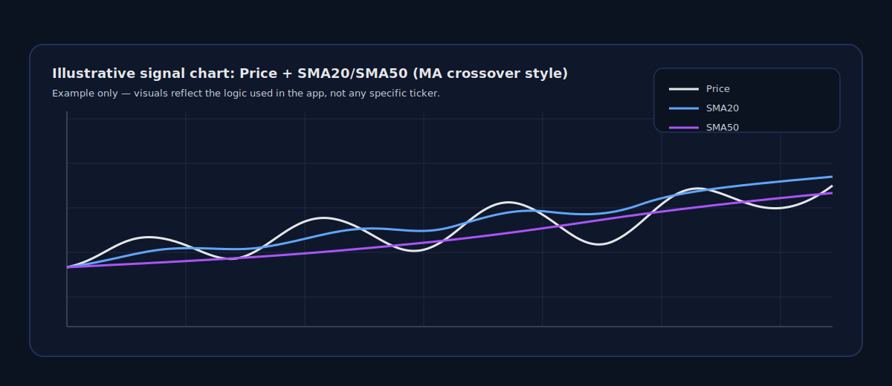
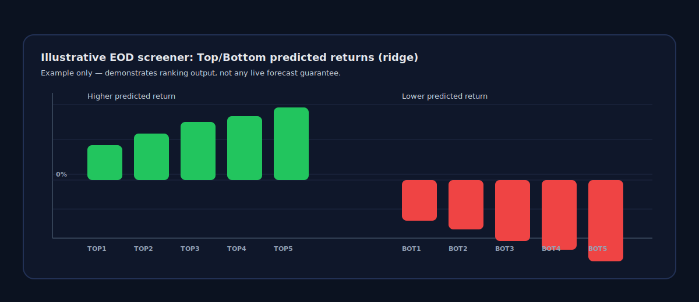
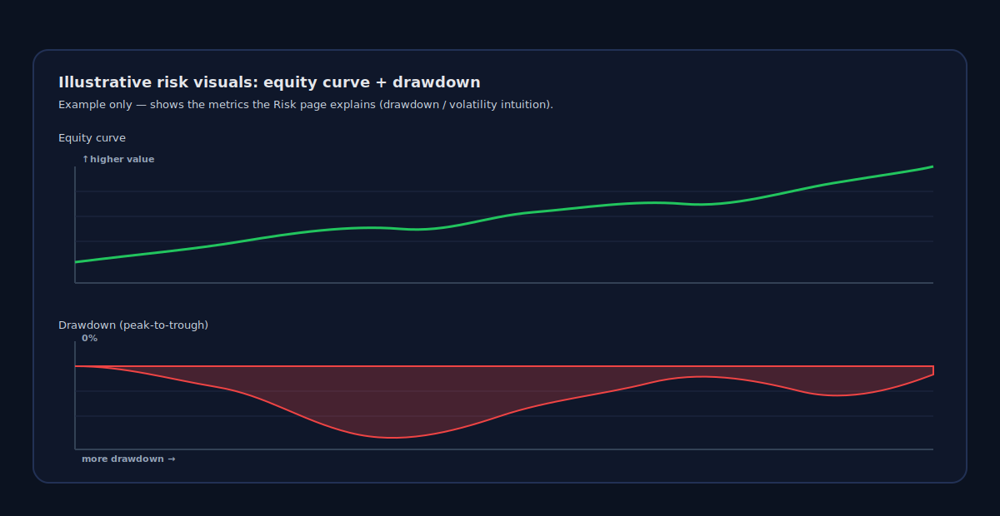
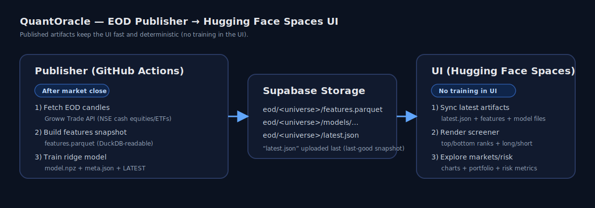

# QuantOracle

India-first quant research + portfolio intelligence app (Streamlit) with an EOD market screener pipeline.

[Live app (Hugging Face Spaces)](https://huggingface.co/spaces/thinkingEverytime/QuantOracle) (cold start can take a couple minutes)

[](https://github.com/rishigupta2004/QuantOracle/actions/workflows/ci.yml)
[](https://github.com/rishigupta2004/QuantOracle/actions/workflows/eod_pipeline.yml)
[](#)
[](LICENSE)

## What’s Inside

- **Markets**: candlesticks + indicators + symbol search (India-first)
- **Portfolio**: holdings, P/L, simple rebalance suggestions
- **Risk**: VaR, max drawdown, beta/correlation
- **Quant ML**:
  - single-stock baselines (on-demand)
  - EOD market screener (published snapshot after close; fast + deterministic in the UI)

## Data (Practical Coverage)

- **NSE cash equities + ETFs (EOD)**: designed to work reliably via the Groww Trade API publisher
- **Indices**: shown via **tradable ETF proxies** (e.g., `NIFTYBEES.NS`, `BANKBEES.NS`, `ITBEES.NS`)
- **Global tickers / crypto**: best-effort via Yahoo (UI convenience / fallback)

## Machine Learning

### Single Stock (On-Demand Baselines)
- **Moving Average**: SMA20/SMA50 crossover signal
- **Multi-factor Technical Score**: combines indicators (RSI / trend / volatility-style heuristics)
- **Mean Reversion**: Bollinger Bands + RSI oversold/overbought logic

### EOD Market Screener (Published)
- **Model**: ridge regression (closed-form; no sklearn dependency)
- **Target**: predicted forward return (default horizon: 5 trading days)
- **Features (lightweight + robust)**: recent returns (1d/5d/20d), 20d volatility, price vs SMA20/SMA50, RSI14
- **Outputs**: top/bottom ranks + a constraint-based long/short portfolio

## Risk + Quant Portfolio

- **VaR (95/99)**: daily-loss estimate from the return distribution
- **Max drawdown**: largest peak-to-trough fall over the lookback window
- **Beta / correlation**: market sensitivity vs an India market proxy (`NIFTYBEES.NS`)
- **Long/short construction (EOD)**: constraints for gross/net exposure + max per-name weight

## Visuals (Illustrative)

These example visuals show the kind of outputs QuantOracle produces (not a claim about any specific ticker’s future performance).







## Architecture (EOD Pipeline)

Hugging Face Spaces storage is ephemeral, so QuantOracle uses a published-artifacts workflow:

- **Publisher (GitHub Actions, after close)**: fetches EOD candles (Groww), builds a feature snapshot, trains a ridge model, uploads artifacts
- **UI (Hugging Face Spaces)**: downloads `latest.json` + `features.parquet` + model files and renders instantly (no training in the UI)



## Repository Layout

```text
frontend/          Streamlit app (pages, theme, services)
quant/             Core analytics + features + model helpers
scripts/           Publisher + diagnostics
tests/             pytest suite
streamlit_app.py   Hugging Face Spaces entrypoint (repo root)
data/universe/     Universe lists (tracked)
```

## Roadmap (Next-Level Quant)

- Walk-forward evaluation reports + model registry/versioning UI
- Better models (GBDT) + broader feature set + factor diagnostics
- Long/short portfolio construction with constraints (gross/net, caps, turnover, risk sizing)
- Persistent portfolio storage (Supabase DB) + scheduled universe management
- Raise test coverage target to 90%+ (currently gated at 50% to move fast; increase once core pipeline is stable)

## Disclaimer

Not investment advice. Data source availability and licensing vary by provider.

## License

MIT - see `LICENSE`.
