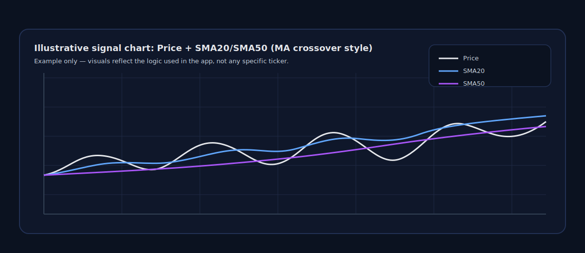
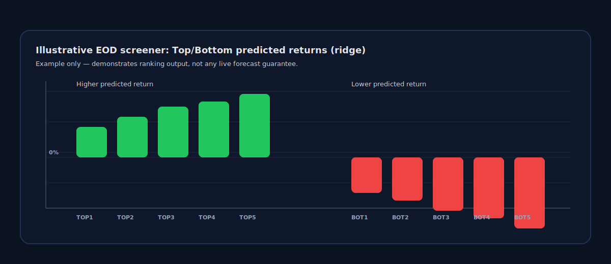
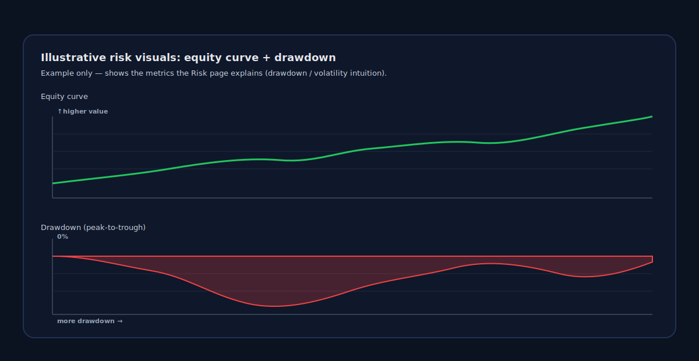
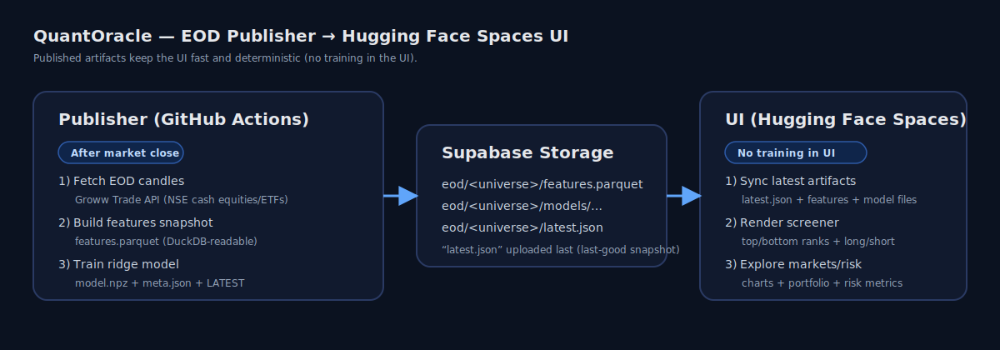

# QuantOracle

India-first quant research + portfolio intelligence app (Streamlit) with an EOD market screener pipeline.

[Live app (Hugging Face Spaces)](https://huggingface.co/spaces/thinkingEverytime/QuantOracle) (cold start can take a couple minutes)

[](https://github.com/rishigupta2004/QuantOracle/actions/workflows/ci.yml)
[](https://github.com/rishigupta2004/QuantOracle/actions/workflows/eod_pipeline.yml)
[](#)
[](LICENSE)

## What’s Inside

- **Markets**: candlesticks + indicators + symbol search (India-first)
- **Portfolio**: holdings, P/L, simple rebalance suggestions
- **Risk**: VaR, max drawdown, beta/correlation
- **Quant ML**:
  - single-stock baselines (on-demand)
  - EOD market screener (published snapshot after close; fast + deterministic in the UI)

## Data (Practical Coverage)

- **NSE cash equities + ETFs (EOD/intraday snapshots)**: provider chain with `--provider auto` (Upstox -> Groww -> EODHD/Finnhub -> Yahoo fallback)
- **Indices**: shown via **tradable ETF proxies** (e.g., `NIFTYBEES.NS`, `BANKBEES.NS`, `ITBEES.NS`)
- **Global tickers / crypto**: free-first fallbacks (CoinGecko + Yahoo)
- **News**: daily published intel snapshot (`news/intel/latest.json`) with official-source + impact tags, then live fallback chain (NewsData/TheNewsAPI/GNews/RSS)

## Machine Learning

### Single Stock (On-Demand Baselines)
- **Moving Average**: SMA20/SMA50 crossover signal
- **Multi-factor Technical Score**: combines indicators (RSI / trend / volatility-style heuristics)
- **Mean Reversion**: Bollinger Bands + RSI oversold/overbought logic

### EOD Market Screener (Published)
- **Model**: ridge regression (closed-form; no sklearn dependency)
- **Target**: predicted forward return (default horizon: 5 trading days)
- **Features (lightweight + robust)**: recent returns (1d/5d/20d), 20d volatility, price vs SMA20/SMA50, RSI14
- **Outputs**: top/bottom ranks + a constraint-based long/short portfolio

## Risk + Quant Portfolio

- **VaR (95/99)**: daily-loss estimate from the return distribution
- **Max drawdown**: largest peak-to-trough fall over the lookback window
- **Beta / correlation**: market sensitivity vs an India market proxy (`NIFTYBEES.NS`)
- **Long/short construction (EOD)**: constraints for gross/net exposure + max per-name weight

## Visuals (Illustrative)

These example visuals show the kind of outputs QuantOracle produces (not a claim about any specific ticker’s future performance).







## Architecture (EOD Pipeline)

Hugging Face Spaces storage is ephemeral, so QuantOracle uses a published-artifacts workflow:

- **Publisher (GitHub Actions, after close)**: fetches EOD candles via provider chain (`auto`), builds a feature snapshot, trains a ridge model, uploads artifacts
- **UI (Hugging Face Spaces)**: downloads `latest.json` + `features.parquet` + model files and renders instantly (no training in the UI)



## New Web App (Vercel)

QuantOracle now includes a full Next.js command center in `web/` (single-project deploy to Vercel):

- UI: workspace plan badge, upgrade modal, entitlement gates, usage meter cards
- API routes (same project):
  - `GET /api/health`
  - `GET /api/status` (provider/key readiness + optional probe)
  - `GET /api/billing/workspaces/{id}/usage`
  - `GET /api/quotes`
  - `GET /api/news`
  - `GET /api/macro`
  - `GET /api/upstox/callback`

Run locally:

```bash
cd web
npm install
npm run dev
```

Then open `http://localhost:3000`.

Web shell shortcuts:

- `Cmd/Ctrl + K`: command palette
- `Alt + L` / `Alt + R`: toggle left/right drawers
- `Alt + 1..5`: focus map/quotes/news/macro/entitlements
- `Alt + 6..8`: set layout preset (`atlas` / `focus` / `stack`)
- `Alt + Q/W/E`: load layout slot `1/2/3`
- `Alt + Shift + Q/W/E`: save current layout to slot `1/2/3`
- `Alt + 0`: reset layout (drawers + panels + slots)

Deployment smoke test:

```bash
python scripts/smoke_vercel_web.py --base-url https://quant-oracle.vercel.app
```

Strict mode (fails on schema/status checks):

```bash
python scripts/smoke_vercel_web.py --base-url https://quant-oracle.vercel.app --strict
```

Published data freshness check (quotes + EOD + news intel):

```bash
python scripts/check_data_freshness.py --strict
```

Manual news intel publish:

```bash
python scripts/publish_news_intel.py --max-items 60 --upload
```

Push available local env values to Vercel (prod+dev):

```bash
python scripts/push_vercel_env.py --root . --targets production,development
```

Push preview env values for a specific branch:

```bash
python scripts/push_vercel_env.py --root . --targets preview --preview-branch main
```

## Upstox Pending Mode

If Upstox account activation is pending (no access token/map yet), QuantOracle web still works with:

- Billing cards + entitlement gates
- News pipeline
- Macro pulse
- Crypto quotes (CoinGecko)
- Supabase snapshot fallback for symbols available in `quotes.json`

Once Upstox is active, set `UPSTOX_ACCESS_TOKEN` + `UPSTOX_SYMBOL_MAP` in Vercel and redeploy to enable live India quote coverage.

## Repository Layout

```text
api/               FastAPI backend (billing/workspace usage endpoint)
web/               Next.js app + API routes for Vercel deployment
frontend/          Streamlit app (pages, theme, services)
quant/             Core analytics + features + model helpers
scripts/           Publisher + diagnostics
tests/             pytest suite
streamlit_app.py   Hugging Face Spaces entrypoint (repo root)
data/universe/     Universe lists (tracked)
```

## Roadmap (Next-Level Quant)

- Walk-forward evaluation reports + model registry/versioning UI
- Better models (GBDT) + broader feature set + factor diagnostics
- Long/short portfolio construction with constraints (gross/net, caps, turnover, risk sizing)
- Persistent portfolio storage (Supabase DB) + scheduled universe management
- Raise test coverage target to 90%+ (currently gated at 50% to move fast; increase once core pipeline is stable)

## Disclaimer

Not investment advice. Data source availability and licensing vary by provider.

## License

MIT - see `LICENSE`.
